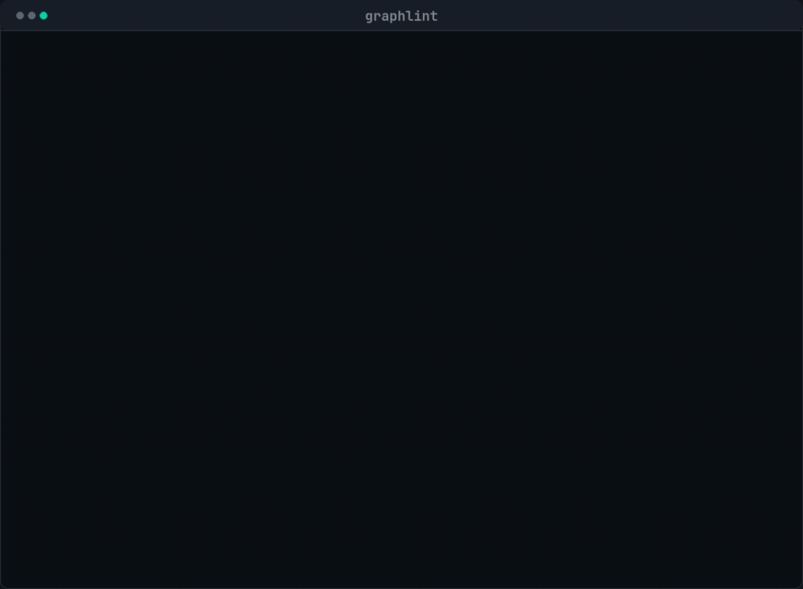

<div align="center">
  
  <h1>graphlint</h1>
  <p><strong>Static analyzer for agent workflow specs.</strong><br>
  <sub>Catches barrier misuse, correlated verifiers, missing schemas and non-terminating cycles before a token is spent.</sub></p>
  <p>
    <a href="https://unchained-labs.github.io/graphlint/">Docs</a> ·
    <a href="#rules">Rules</a> ·
    <a href="#why">Why</a>
  </p>
</div>

<div align="center">
  
  <br><sub>16 rules, zero tokens, no network calls. <a href="https://unchained-labs.github.io/graphlint/">Full docs →</a></sub>
</div>

---

**Status: alpha.** The rule set is stable enough to run in CI; rule ids and the
JSON shape may still change before 1.0. Pin an exact version.

```
$ graphlint check .claude/workflows/

.claude/workflows/review.js (script)

  ✗ This `parallel()` barrier's result is only reshaped, never compared across items.  unjustified-barrier
   24 │ const found = await parallel(DIMENSIONS.map((d) => () => agent(d.prompt)))
      │                     ~
     fix Use `pipeline(items, stage1, stage2)` and put the reshape inside a stage.

  ✗ 3 verifiers spawned from one factory with no varying lens, model or index.  correlated-verifiers
   31 │     agent(`Verify this finding is real. Answer yes or no.`),
      │     ~~~~~~~~~~~~~~~~~~~~~~~~~~~~~~~~~~~~~~~~~~~~~~~~~~~~~~
     fix Vary the lens (three different questions beat three identical ones, and it is free)…

2 errors · 3 warnings in 1 file
```

## What it does not do

- **It does not run your workflow.** It is a static analyzer; it never spawns an
  agent, never calls a model, and costs nothing to run.
- **It does not estimate cost.** That is [preflight](https://github.com/Unchained-Labs/preflight).
- **It does not measure verifier independence from real runs.** It flags
  *structurally* identical verifiers from the source. Measuring actual
  correlation across recorded verdicts is
  [decorrelate](https://github.com/Unchained-Labs/decorrelate).
- **It will produce false positives on unusual graphs.** Barriers in particular:
  a barrier that is load-bearing for a reason `graphlint` cannot see reads as
  unjustified. Turn the rule off per-repo rather than working around it.

## Install

```sh
npm i -D graphlint     # or pnpm add -D graphlint
npx graphlint check .
```

Node 20+. No configuration required.

## Usage

```sh
graphlint check [paths...]      # lint scripts and specs (default: .)
graphlint rules                 # every rule and what it enforces
graphlint explain <rule>        # the reasoning for one rule
graphlint graph <file>          # print the parsed graph as mermaid
```

| Flag | Effect |
| :--- | :--- |
| `--format pretty\|json\|sarif` | Output format. `sarif` uploads to the GitHub Security tab. |
| `--verbose`, `-v` | Include the full reasoning behind each finding. |
| `--quiet`, `-q` | Suppress info-level findings. |
| `--max-warnings N` | Exit non-zero if warnings exceed N. |
| `--rule <id>` | Run only this rule. Repeatable. |

Exit code is `1` if any error fired (or warnings exceed `--max-warnings`), `0`
otherwise, `2` on bad usage.

### Two input shapes

`graphlint` reads both forms a graph comes in:

**Workflow scripts** — `agent()`, `parallel()`, `pipeline()`, `phase()`, with
`export const meta`. Parsed with a real JS parser, not regexes, because almost
every interesting property is contextual: whether an `agent()` is inside a
cycle, which pipeline stage it belongs to, whether its result is consumed
without a schema.

**Declarative graph specs** — `*.graph.json`, `*.spec.json`. Nodes and edges as
data. Here the checks are structural too: unreachable nodes, cycles with no
declared cap, `barrier: true` with no `barrierReason`.

A bare directory is scanned for `*.graph.json`, `*.spec.json`, anything under a
`workflows/` directory, and scripts that actually call `agent()`. It does not
lint every `.js` file in your repo.

### Config

Optional `.graphlintrc.json`:

```json
{
  "rules": {
    "conjunction-prompt": "off",
    "missing-schema": "error"
  }
}
```

### CI

```yaml
- run: npx graphlint check .claude/workflows --format sarif > graphlint.sarif
- uses: github/codeql-action/upload-sarif@v3
  with: { sarif_file: graphlint.sarif }
```

## Rules

16 rules. Each one enforces a specific line from the reference architecture, and
each finding carries both the reasoning and the fix — a linter that says "don't"
without saying "because" gets disabled by the second week.

### Errors — costs money or does not terminate

| Rule | Catches |
| :--- | :--- |
| `agent-as-reduce` | An agent spawned to combine, merge or dedupe results. That is an edge, not a node — `flatMap` and a `Set` do it for zero tokens. |
| `correlated-verifiers` | N identical verifiers. Three skeptics with the same model and the same prompt are one check at 3× the price. |
| `unbounded-cycle` | A cycle spawning agents with no dry-round counter or no hard cap. |
| `resurfacing-cycle` | A cycle deduping against *confirmed* results instead of everything *seen*, so rejected findings resurface forever and the loop never converges. |
| `null-unsafe-fanin` | A fan-in that assumes a full result set. One failed node then kills a run that had 8 of 9 results. |
| `nondeterminism` | `Date.now()`, `Math.random()`, argless `new Date()` — each one invalidates the resume cache and turns a crash into a full re-spend. |
| `unisolated-writer` | Parallel agents editing files without `isolation: "worktree"`. Fails silently: the tree compiles and is wrong. |
| `spec-structure` | Unreachable nodes and uncapped cycles in a declarative spec. |

### Warnings — will cost you at scale

| Rule | Catches |
| :--- | :--- |
| `unjustified-barrier` | A `parallel()` whose result is only reshaped, or `barrier: true` with no `barrierReason`. |
| `missing-schema` | Free text consumed downstream instead of a validated contract. |
| `untiered-graph` | No model or effort set anywhere, so every node inherits the session model. |
| `silent-cap` | A truncated work list with no log — the report reads as full coverage. |
| `missing-meta` | No `export const meta`, so the run is unnamed and its phases ungrouped. |

### Info — worth a look

| Rule | Catches |
| :--- | :--- |
| `conjunction-prompt` | A prompt asked to scan *and* write. Two verbs, two nodes. |
| `phase-mismatch` | `phase()` titles and `meta.phases` disagree. |
| `uniform-verification` | Every finding verified equally hard, with no severity threshold. |

`graphlint explain <rule>` for any of them.

## Why

Agent graphs fail in a small number of ways, over and over, and every one of them
is mechanically detectable in the source:

- A barrier where a stream would do. `parallel()` waits for the slowest item;
  `pipeline()` does not. Same agents, same work, strictly more waiting.
- Three verifiers that share a model, a temperature and a prompt scaffold. They
  fail identically, so "3 of 3 agree" can be one error counted three times — at
  triple the cost.
- A cycle that dedupes against the wrong set and never terminates.
- Free text crossing an edge that a downstream node parses.

None of these need a run to find. They are visible in the spec, which is the
cheapest possible place to catch them — before a token is spent, in the same pass
as your other linters.

## Development

```sh
pnpm install
pnpm build
pnpm test          # 57 tests
node dist/cli.js check test/fixtures/bad
```

`test/fixtures/good/` must lint clean and `test/fixtures/bad/` must trip every
rule it was written to trip — both are asserted. If you add a rule, add a case
to each.

## Licence

MIT. Part of [Unchained Labs](https://unchained-labs.github.io/) — see also
[preflight](https://github.com/Unchained-Labs/preflight) (cost),
[decorrelate](https://github.com/Unchained-Labs/decorrelate) (verifier
independence) and
[workflow-hub](https://github.com/Unchained-Labs/workflow-hub) (specs that lint
clean out of the box).
